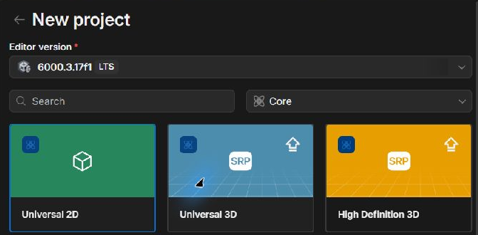
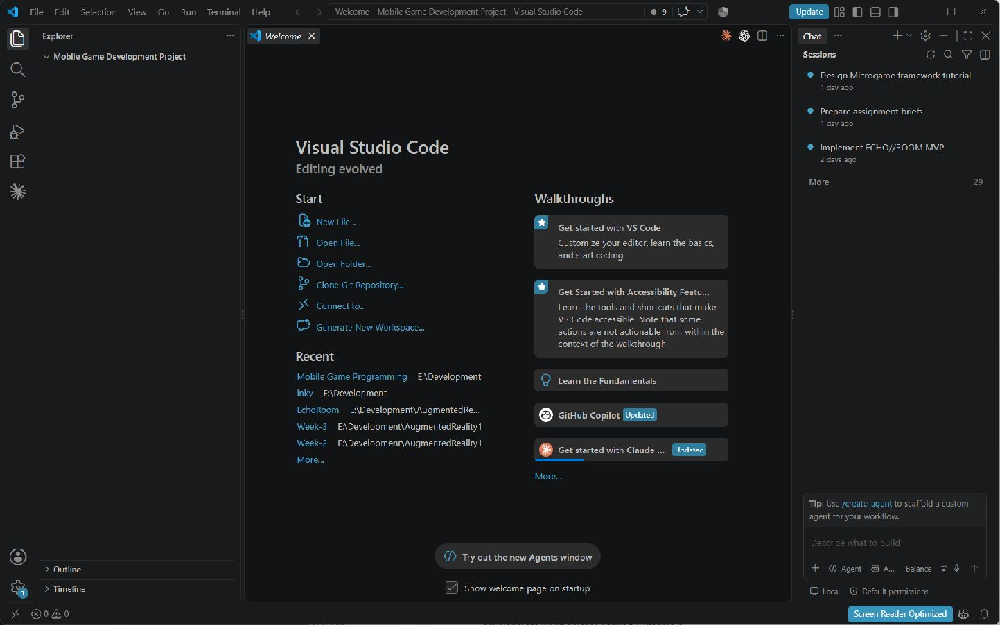
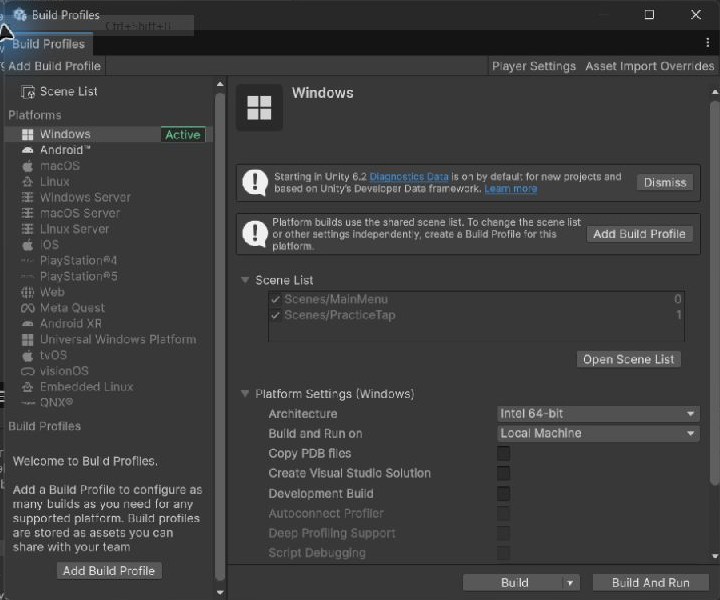
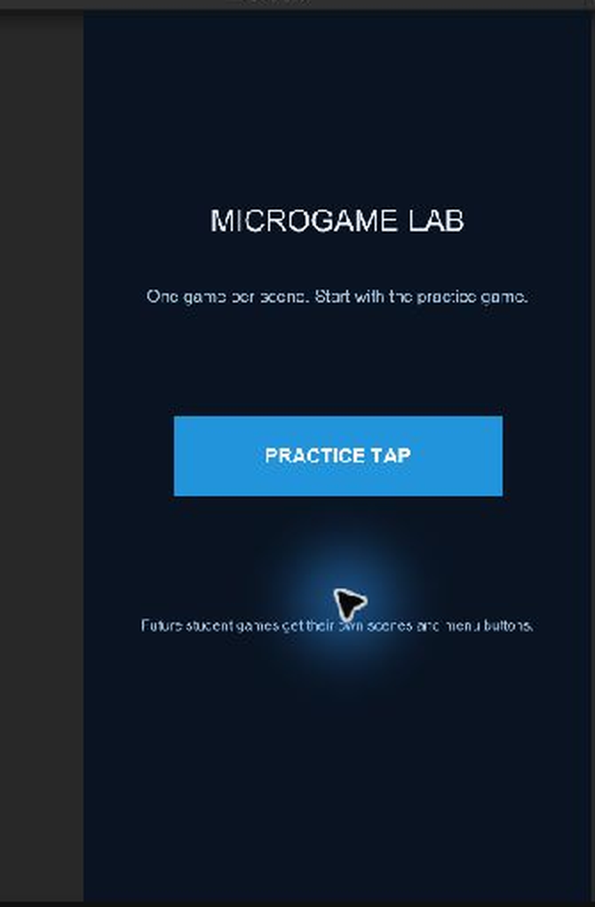
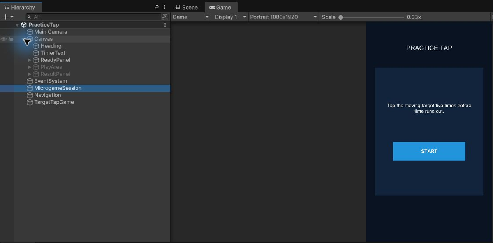
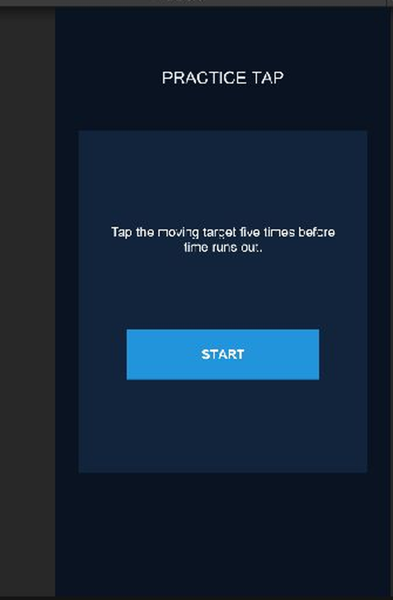
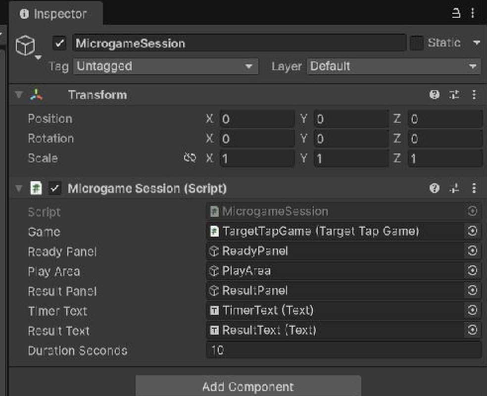
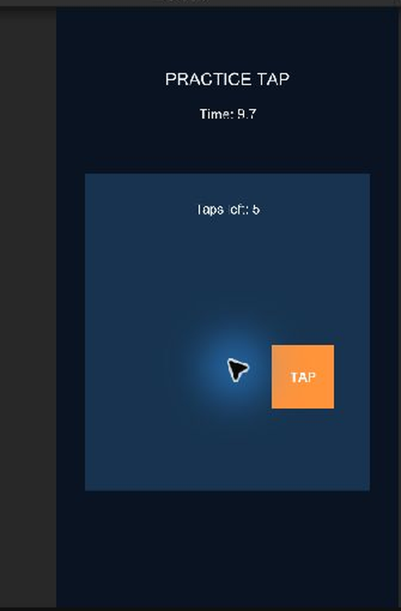
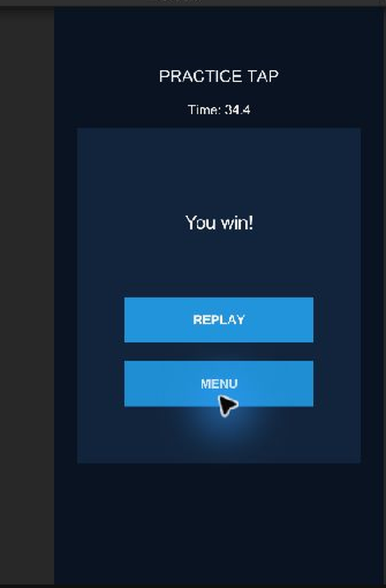
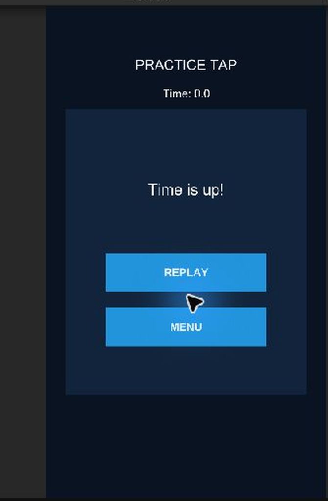

# Make your first microgame in Unity 6.3

This is a guided practice exercise for someone new to Unity and C#. You will type the `TargetTapGame` code yourself, attach it to objects in one scene, and test it through the shared framework. The game asks the player to tap a target five times in ten seconds. It works with a mouse in the Unity editor and a finger on a touch screen. Do not use Copilot to write this game for you. Your four assessed games need their own student-authored rules and code.

Allow about two teaching sessions. Save the scene and commit after each working checkpoint. Use the Console tab whenever the editor reports a problem.

## 1. Start with the project and scenes

Create a Unity **6.3** project in Unity Hub using the **Core > Universal 2D** template. Name it for your own portfolio and keep it inside your assessment repository. Open the project folder in VS Code. The screenshots show the template choice and an empty VS Code folder with the chat area where you will later enter one framework prompt at a time.





In Unity's Project window, create folders named `Scenes`, `Scripts`, `Scripts/Framework` and `Scripts/Microgames/PracticeTap` under `Assets`. Save a new scene as `Assets/Scenes/MainMenu.unity`. Save another as `Assets/Scenes/PracticeTap.unity`. Open **File > Build Profiles > Platforms > Scene List** and add both scenes, with `MainMenu` first. A saved scene file alone is not enough: Unity builds can load only scenes present in that list.



**Check:** open each scene from the Project window. The scene name shown in the Hierarchy title should match the file you clicked. Return to `MainMenu`.

## 2. Add the framework scripts in three small passes

Follow stages 1–3 in [the prompt sheet](FRAMEWORK_PROMPTS.md). After each pass, read Copilot's proposed code, accept only the requested framework file, return to Unity and wait for compilation. If the Console shows a red error, fix it before continuing. Do not paste the next prompt into an uncompiled project. You will test the scene behaviour after making and wiring the objects below; the scripts can compile before those objects exist.

The three scripts have different jobs:

| Script | Job |
|---|---|
| `SceneNavigator` | Loads the menu, a game scene, or the current scene for replay. |
| `MicrogameBehaviour` | Gives every game `Begin`, `End`, `Win` and `Lose`. |
| `MicrogameSession` | Controls Ready, Playing, timer and Result inside one game scene. |

**Check:** you can describe which script owns the timer and which owns the tap rules. The framework does not contain the tap rules.

## 3. Make the menu scene

Open `MainMenu`. In the Hierarchy, add **UI > Canvas**. Unity should also create an `EventSystem`; if it does not, add **UI > Event System**. Set the Canvas Scaler to **Scale With Screen Size**, reference resolution **1080 × 1920**, match **0.5**. In the Game view choose a portrait aspect ratio such as **9:16**.

Inside the Canvas create a **UI > Legacy > Text** named `Title`, set its text to `MICROGAME LAB`, and place it near the top. Create a **UI > Legacy > Button** named `PracticeButton`, set the child label to `PRACTICE TAP`, and place it in the middle. Use large text and a button wide enough for a finger. Create an empty GameObject named `Navigation` and add `SceneNavigator` to it. On the button's **On Click()** list, press `+`, drag `Navigation` into the object slot, and choose `SceneNavigator > OpenPractice()`.

If the Button appears without a child label, add a Legacy Text as its child and disable **Raycast Target** on that text. The button Image receives the pointer input.

Save. Press Play, click the button and check that the active scene changes to `PracticeTap`. The destination will still be empty at this point. Stop Play mode before editing.



## 4. Build one game scene, not a stack of games

Open `PracticeTap`. Add a Canvas and EventSystem as above. Under the Canvas create:

```text
Canvas
├── Heading (Legacy Text: PRACTICE TAP)
├── TimerText (Legacy Text)
├── ReadyPanel (Image)
│   ├── ReadyText (Legacy Text: Tap the moving target five times...)
│   └── StartButton (Button)
├── PlayArea (Image, about 900 × 1000 at the reference resolution)
│   ├── ProgressText (Legacy Text)
│   └── TargetButton (Button, about 200 × 200)
└── ResultPanel (Image)
    ├── ResultText (Legacy Text)
    ├── ReplayButton (Button)
    └── MenuButton (Button)
MicrogameSession
Navigation
TargetTapGame
EventSystem
```

Make the target a child of `PlayArea`. Put its Rect Transform anchors and pivot at the **centre**. Keep the target fully inside the play area. For each Text component, uncheck **Raycast Target** so it cannot intercept button taps. Give the panels different colours while learning; this makes the active state obvious. Place `ReadyPanel` and `ResultPanel` in the same position. Both belong to this one game scene. In the Hierarchy, untick `PlayArea` and `ResultPanel` so the saved scene shows only Ready. The session will switch their active states during Play mode.

To match the worked example, right click the Canvas for each top-level item. Use **UI > Image** for panels, **UI > Legacy > Text** for text and **UI > Legacy > Button** for buttons. Drag child items onto their parent in the Hierarchy. Select an item, set its Rect Transform anchor preset to middle-centre, then enter **Pos X**, **Pos Y**, **Width** and **Height** in the Inspector. The values below use the 1080 × 1920 reference resolution; you can choose other colours.

| Item (parent) | Pos X, Pos Y | Width × Height | Text or detail |
|---|---:|---:|---|
| Heading (Canvas) | 0, 720 | 850 × 120 | `PRACTICE TAP`, font 54 |
| TimerText (Canvas) | 0, 610 | 700 × 90 | blank, font 44 |
| ReadyPanel (Canvas) | 0, 0 | 930 × 1100 | dark Image |
| ReadyText (ReadyPanel) | 0, 200 | 760 × 240 | `Tap the moving target five times before time runs out.`, font 42 |
| StartButton (ReadyPanel) | 0, -170 | 620 × 160 | `START` |
| PlayArea (Canvas) | 0, -80 | 900 × 1000 | contrasting Image |
| ProgressText (PlayArea) | 0, 390 | 750 × 100 | `Taps left: 5`, font 42 |
| TargetButton (PlayArea) | 0, 0 | 200 × 200 | `TAP`, bright colour |
| ResultPanel (Canvas) | 0, 0 | 930 × 1100 | dark Image |
| ResultText (ResultPanel) | 0, 240 | 760 × 180 | blank, font 60 |
| ReplayButton (ResultPanel) | 0, -80 | 620 × 150 | `REPLAY` |
| MenuButton (ResultPanel) | 0, -290 | 620 × 150 | `MENU` |

For every Text, set **Alignment** to middle-centre. If a new Button's child label is small, select that child Text and increase its font size to about 42. `TimerText` and `ResultText` start blank because the session fills them in during Play mode.

Add `MicrogameSession` to the `MicrogameSession` object and `SceneNavigator` to `Navigation`. The script named `TargetTapGame` will be added in the next steps. Save the scene.

**Check:** the Hierarchy contains exactly one game area. `MainMenu` is absent from this Hierarchy because it is another scene.





## 5. Write the game class yourself

In VS Code, create `Assets/Scripts/Microgames/PracticeTap/TargetTapGame.cs`. Type the following sections in order. The filename and class name must match exactly. Save after each section and let Unity compile. Do not accept a whole-file Copilot completion for this exercise.

First add the namespaces and class. `MicrogameBehaviour` comes from the framework; `RectTransform` and `Random` come from Unity; `Text` comes from uGUI.

```csharp
using MicrogameCourse.Framework;
using UnityEngine;
using UnityEngine.UI;

namespace MicrogameCourse.Microgames
{
    public sealed class TargetTapGame : MicrogameBehaviour
    {
    }
}
```

Add these fields **inside** the class. Fields with `[SerializeField]` appear in the Unity Inspector even though they are `private`. The last field is runtime state and should not be dragged to an object.

```csharp
[SerializeField] private RectTransform playArea;
[SerializeField] private RectTransform target;
[SerializeField] private Text progressText;
[SerializeField, Min(1)] private int tapsToWin = 5;

private int tapsRemaining;
```

Write the beginning of a run. `base.Begin(session)` tells the framework this game is now running. The remaining count is reset every time a new run starts. `UpdateProgress` and `MoveTarget` will be added shortly.

```csharp
public override void Begin(MicrogameSession session)
{
    base.Begin(session);
    tapsRemaining = tapsToWin;
    UpdateProgress();
    MoveTarget();
}
```

Write the method that the target button will call. The first line rejects taps after a win or timeout. The `if` chooses between winning and moving the target again.

```csharp
public void TapTarget()
{
    if (!IsRunning) return;

    tapsRemaining--;
    UpdateProgress();

    if (tapsRemaining == 0)
        Win();
    else
        MoveTarget();
}
```

Finally add the two small helper methods. `anchoredPosition` is the target's position relative to its centred UI anchors. Half of the spare width and height gives a boundary that keeps the whole button visible. `Random.Range` chooses a new position inside that boundary.

```csharp
private void UpdateProgress()
{
    progressText.text = $"Taps left: {tapsRemaining}";
}

private void MoveTarget()
{
    float maxX = (playArea.rect.width - target.rect.width) * 0.5f;
    float maxY = (playArea.rect.height - target.rect.height) * 0.5f;
    float x = Random.Range(-maxX, maxX);
    float y = Random.Range(-maxY, maxY);
    target.anchoredPosition = new Vector2(x, y);
}
```

Save. If Unity shows an error, compare braces `{ }`, semicolons, capital letters and the filename with the snippets before asking for help. You may ask Copilot to **explain an error message**, while keeping the game implementation your own.

## 6. Connect code to scene objects

Back in Unity, add `TargetTapGame` to the empty `TargetTapGame` object. Select it and fill its Inspector slots:

| Field | Drag from Hierarchy |
|---|---|
| Play Area | `PlayArea` |
| Target | `TargetButton` |
| Progress Text | `ProgressText` |
| Taps To Win | `5` |

Select the `MicrogameSession` object. Drag `TargetTapGame`, `ReadyPanel`, `PlayArea`, `ResultPanel`, `TimerText` and `ResultText` into their matching slots. Set **Duration Seconds** to `10`. `Game` must refer to the component on `TargetTapGame`, not the button.



Wire buttons via their **On Click()** lists:

| Button | Object | Method |
|---|---|---|
| StartButton | MicrogameSession | `StartGame()` |
| TargetButton | TargetTapGame | `TapTarget()` |
| ReplayButton | Navigation | `Replay()` |
| MenuButton | Navigation | `OpenMenu()` |

Save the scene. A missing Inspector reference often causes a `NullReferenceException` on Play. Double click the Console error to see its script and line, then inspect the fields on that object.

## 7. Test the whole route

Open `MainMenu` and press Play. Run each case separately. Record expected and actual results in a small table in your repository; a screenshot alone does not show what you checked.

| Test | Action | Expected |
|---|---|---|
| 1 | Press Practice | Practice scene opens with Ready instructions. |
| 2 | Press Start | Timer begins near 10; target and progress appear. |
| 3 | Tap target five times | Target moves after each of the first four taps; fifth tap shows `You win!`. |
| 4 | Press Replay | Scene returns to Ready; count and timer are fresh. |
| 5 | Start and wait | `Time is up!` appears; no more taps count. |
| 6 | Press Menu | Main menu opens. |

The reference project produces these states in Unity's Game view. Your colours and positions may differ; the behaviour should match.

| Playing | Win after five taps | Timeout |
|---|---|---|
|  |  |  |

For a mobile check, switch to a portrait device simulator or make a device build after the editor version works. Use a finger to play and check that the target and buttons are easy to tap. The Unity Game view mouse is a useful first test, but it is not device evidence for the assessment.

## 8. Explain your code before extending it

Answer these in your own words in a commit or short README: Why is `tapsRemaining` a field? Why does `TapTarget` check `IsRunning`? What does `base.Begin(session)` do? Why subtract `target.rect.width` from `playArea.rect.width`? What would happen if the target were anchored at the left edge instead of the centre? Change `tapsToWin` to 3 and predict the outcome before pressing Play.

When you can answer those questions and all six tests pass, complete stage 4 of the prompt sheet to review the framework. Then build your first assessed microgame in a **new scene**. Choose a different core mechanic and write its game rules yourself.
